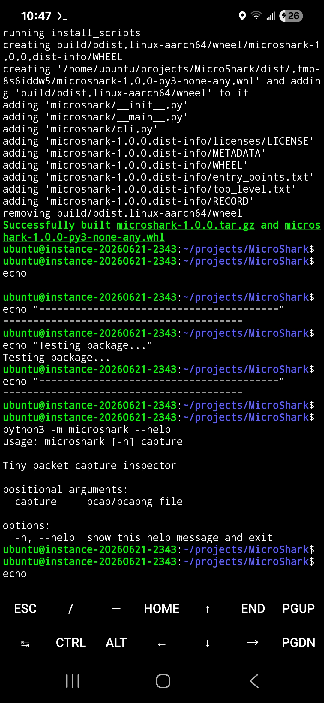

# MicroShark

A simplified packet analyzer.

Goals

- Detect PCAP/PCAPNG
- Decode common protocols
- Follow conversations
- Export reports

Version 1 focuses on capture inspection.

---

## Overview

Minimal packet inspection utility designed to teach packet analysis concepts.

## Features

- Lightweight command-line utility
- Educational focus
- Cross-platform Python
- Fast execution
- Minimal dependencies

## Educational Concepts

- Packet analysis
- Network traffic
- Protocol inspection
- Troubleshooting

## Roadmap

- Improved documentation
- Additional examples
- Enhanced command-line options

## License

MIT License

---

## Screenshot

